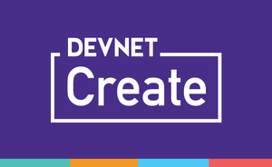

# DevNet Create Golang

"Getting Started with Golang" - Written for DevNet Create 2019 (April 24-25) - Computer History Museum, Mountain View, CA

# Agenda

- Why Golang today?
- Golang vs [insert code here]
- Gophercising, exercises for building code
- Hello world!
- If Conditions
- For Loops
- Switch Statements
